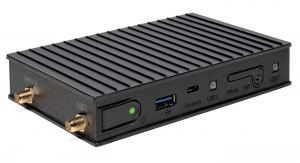

# Nerves CompuLab IOT-GATE-IMX8PLUS

This is the base Nerves System configuration for the [CompuLab IOT-GATE-IMX8PLUS](https://www.compulab.com/products/iot-gateways/iot-gate-imx8plus-industrial-arm-iot-gateway/).


<br><sup>[Image credit](#compulab)</sup>

| Feature              | Description                     |
| -------------------- | ------------------------------- |
| CPU                  | 4 x 1.8 GHz ARM Cortex-A53      |
| MCU                  | 800 Mhz ARM Cortex-M7           | 
| Memory               | 1-8 GB DRAM                     |
| Storage              | 16-128 GB eMMC Flash            |
| Linux kernel         | 5.15 imx-linux                  |
| IEx terminal         | UART `ttymxc1`                  |
| GPIO, I2C, SPI       | Yes - [Elixir Circuits](https://github.com/elixir-circuits) |
| Camera               | None                            |
| Ethernet             | 2x 1000Mbps                     |
| WiFi                 | 802.11ax WiFi                   |
| HW Watchdog          | Hardware watchdog enabled on boot. Be sure to enable `heart` in your vm.args or the device will reboot |

## Using

The most common way of using this Nerves System is create a project with `mix
nerves.new` and to export `MIX_TARGET=cl_iot_gate_imx8plus`. See the [Getting started
guide](https://hexdocs.pm/nerves/getting-started.html#creating-a-new-nerves-app)
for more information.

If you need custom modifications to this system for your device, clone this
repository and update as described in [Making custom
systems](https://hexdocs.pm/nerves/customizing-systems.html).

## Preparing your CompuLab IOT-GATE-IMX8PLUS

The IOT-GATE-IMX8PLUS gateway uses the hardware BOOT part 1 to store the 
U-Boot bootloader. The system needs to be initially programmed using the 
[uuu programming utility](https://github.com/NXPmicro/mfgtools). 

To program the system you will need the bootloader file from the NERVES_SYSTEM
images directory, and a disk image from the FWUP file.

For mor information see the `initialize_firmware` project in the system directory.

## Provisioning devices

This system supports storing provisioning information in a small key-value store
outside of any filesystem. Provisioning is an optional step and reasonable
defaults are provided if this is missing.

Provisioning information can be queried using the Nerves.Runtime KV store's
[`Nerves.Runtime.KV.get/1`](https://hexdocs.pm/nerves_runtime/Nerves.Runtime.KV.html#get/1)
function.

Keys used by this system are:

Key                    | Example Value     | Description
:--------------------- | :---------------- | :----------
`nerves_serial_number` | `"12345678"`       | By default, this string is used to create unique hostnames and Erlang node names. If unset, it defaults to part of the BBB's serial number.

The normal procedure would be to set these keys once in manufacturing or before
deployment and then leave them alone.

For example, to provision a serial number on a running device, run the following
and reboot:

```elixir
iex> cmd("fw_setenv nerves_serial_number 12345678")
```

This system supports setting the serial number offline. To do this, set the
`NERVES_SERIAL_NUMBER` environment variable when burning the firmware. If you're
programming MicroSD cards using `fwup`, the commandline is:

```sh
sudo NERVES_SERIAL_NUMBER=12345678 fwup path_to_firmware.fw
```

Serial numbers are stored on the MicroSD card so if the MicroSD card is
replaced, the serial number will need to be reprogrammed. The numbers are stored
in a U-boot environment block. This is a special region that is separate from
the application partition so reformatting the application partition will not
lose the serial number or any other data stored in this block.

Additional key value pairs can be provisioned by overriding the default
provisioning.conf file location by setting the environment variable
`NERVES_PROVISIONING=/path/to/provisioning.conf`. The default provisioning.conf
will set the `nerves_serial_number`, if you override the location to this file,
you will be responsible for setting this yourself.
